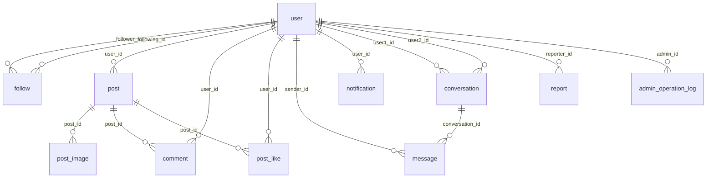

# Miqu「觅取」社交系统 —— 系统设计文档

> 版本：v1.0（设计阶段，未开始编码）
> 依据：`list.md` 项目开发需求
> 目标：业务完整、结构清晰、接口规范、**易测试**、易扩展

---

## 0. 关键技术决策（先定，避免后期返工）

| 决策项 | 选择 | 理由 |
|---|---|---|
| ORM | **MyBatis-Plus**（而非 JPA） ✅ **已确认** | 需求目录结构里已出现 `mapper/`；MP 原生支持逻辑删除、分页插件、字段自动填充（`create_time`/`update_time`），SQL 可控，便于后面用 SQL 对齐数据 |
| Redis | **一期不用**，仅留接口 | 需求原文允许省略；引入会带来缓存一致性/Docker 依赖，降低"能跑起来"的确定性 |
| 即时通讯 | **REST + 轮询**（3~5s），WebSocket 作为第四阶段可选 | 需求明确"不要因追求技术而导致复杂化" |
| 认证 | JWT（HS256，无状态） | 需求指定；不做服务端 Token 黑名单，见【设计问题 14】 |
| 密码存储 | BCrypt（`BCryptPasswordEncoder`） | 需求允许"根据安全策略调整"，BCrypt 是默认正确答案 |
| 软删除 | 仅业务主表（`user`/`post`/`comment`/`message`/`notification`）用 `deleted`；**关系表物理删除** | 见【设计问题 1、19】，这是全局最容易踩的坑 |
| 主键 | `BIGINT UNSIGNED AUTO_INCREMENT` | 不用雪花/UUID，便于测试脚本写死 ID、断言稳定 |
| 分页 | 列表用 **offset 分页**（首页动态/评论提供 cursor 备选） | 中小规模够用；见【设计问题 4】 |
| 时间 | MySQL `DATETIME(3)` + Java `LocalDateTime` + `Asia/Shanghai` | 统一到毫秒，避免测试断言时间戳漂移 |
| Long 序列化 | Jackson 把 `Long`/`long` 序列化为 **String** | JS `Number` 精度 2^53，防前端 ID 精度丢失 |
| 取消关注/点赞的幂等语义 | **404** `NOT_FOLLOWED` / `NOT_LIKED` ✅ **已确认** | 语义明确（"该关系不存在"），测试用例可直接断言；前端需对重复点击做防抖 |
| 私信是否写通知表 | **不写**，只更新 `conversation.*_unread` ✅ **已确认** | 避免同一件事在通知页与消息页重复出现；未读数保持单一事实来源 |

---

## 1. 系统架构

### 1.1 总体架构

```
┌─────────────────────────────────────────────────────────────┐
│                      浏览器 (Vue 3 SPA)                       │
│   Views ── Components ── Pinia Store ── Vue Router           │
│                     │                                        │
│                 Axios 实例（统一 baseURL / Token 注入 / 拦截器）│
└─────────────────────┬───────────────────────────────────────┘
                      │  REST/JSON  ·  Authorization: Bearer <JWT>
┌─────────────────────▼───────────────────────────────────────┐
│                   Spring Boot 3.x 应用                        │
│                                                              │
│  ┌──────────────── Filter 链 ─────────────────┐              │
│  │  JwtAuthenticationFilter  (解析 Token)      │              │
│  │  → SecurityContext / CurrentUser 上下文     │              │
│  └────────────────────┬───────────────────────┘              │
│                       ▼                                       │
│  Controller 层   仅做：参数绑定 + Bean Validation + 调用 Service │
│       │           返回 Result<T>，不写业务分支                 │
│       ▼                                                       │
│  Service 层      业务规则、事务边界、权限校验、组装 VO          │
│       │           抛 BizException(ErrorCode)                  │
│       ▼                                                       │
│  Mapper 层       MyBatis-Plus BaseMapper + 自定义 XML/注解 SQL │
│       │                                                       │
│  ┌────┴──────────────────────────────┐                       │
│  │ 横切组件                           │                       │
│  │ · GlobalExceptionHandler 统一异常  │                       │
│  │ · ResultAdvice / Result<T> 统一响应│                       │
│  │ · MyBatis-Plus 分页 / 自动填充 / 逻辑删除 │                │
│  │ · OperationLogAspect 管理员操作日志│                       │
│  │ · SpringDoc OpenAPI（Swagger UI）  │                       │
│  └───────────────────────────────────┘                       │
└─────────────────────┬───────────────────────────────────────┘
                      │  JDBC (HikariCP)
              ┌───────▼────────┐        ┌──────────────────┐
              │   MySQL 8.x    │        │ 本地文件目录      │
              │  miqu 库        │        │ uploads/ (头像/图)│
              └────────────────┘        └──────────────────┘
```

### 1.2 后端分层职责（对应需求第二十五节）

| 层 | 包 | 职责 | 禁止 |
|---|---|---|---|
| Controller | `controller` | 路由、参数校验（`@Valid`）、调用 Service、返回 `Result<T>` | 禁止出现 `if` 业务分支、禁止直接调 Mapper |
| Service | `service` + `service.impl` | 业务规则、事务（`@Transactional`）、权限判断、Entity↔VO 转换 | 禁止出现 `HttpServletRequest`/`Result` |
| Mapper | `mapper` | 单表 CRUD + 复杂查询 | 禁止写业务规则 |
| Entity | `entity` | 与表一一对应 | — |
| DTO | `dto` | 接收请求（`XxxRequest`/`XxxQuery`） | 禁止直接暴露 Entity 接收入参 |
| VO | `vo` | 返回数据（`XxxVO`） | 禁止直接返回 Entity 给前端 |
| Converter | `converter` | Entity→VO 映射集中管理 | 避免各处手写 `set` |

### 1.3 统一响应与异常

```java
// 统一响应体
public record Result<T>(int code, String message, T data) {
    public static <T> Result<T> ok(T data) { return new Result<>(200, "success", data); }
    public static <T> Result<T> fail(ErrorCode e) { ... }
}
```

分页统一包装：

```json
{ "code": 200, "message": "success",
  "data": { "list": [], "total": 128, "page": 1, "size": 10, "hasNext": true } }
```

**错误码设计**（业务码与 HTTP 语义对齐，便于测试用例直接断言）：

| code | 含义 | 典型场景 |
|---|---|---|
| 200 | 成功 | — |
| 400 | 参数校验失败 | 用户名为空、密码长度不符、邮箱格式错、内容超长 |
| 401 | 未登录 / Token 无效或过期 | 无 Authorization 头、Token 篡改 |
| 403 | 无权限 | 删除他人动态/评论、非管理员访问 `/api/admin/**` |
| 404 | 资源不存在 | 用户/动态/评论/会话不存在 |
| 409 | 资源冲突 | 重复关注、重复点赞、用户名已存在、重复注册 |
| 423 | 账号被禁用 | 被 admin 禁用后登录/操作 |
| 500 | 系统异常 | 兜底 |

`GlobalExceptionHandler` 覆盖：

| 异常 | 映射 |
|---|---|
| `MethodArgumentNotValidException` / `ConstraintViolationException` | 400，取第一条字段错误信息 |
| `BindException` / `HttpMessageNotReadableException` | 400 |
| `BizException`（自定义，带 `ErrorCode`） | 按错误码 |
| `AccessDeniedException` | 403 |
| `AuthenticationException` | 401 |
| `NoHandlerFoundException` / `NoResourceFoundException` | 404 |
| `DuplicateKeyException`（DB 唯一约束兜底） | 409，需按约束名翻译成可读文案 |
| `Exception` | 500，**日志打完整堆栈，响应不暴露堆栈** |

`BizException` 携带 `ErrorCode` + 参数，例如 `ErrorCode.USERNAME_EXISTS`，文案集中定义，避免散落硬编码字符串。

### 1.4 认证与权限

```
注册/登录 ──► 校验 ──► 签发 JWT(sub=userId, role=USER|ADMIN, iat, exp=7d)
                          │
后续请求 ──► JwtAuthenticationFilter ──► 解析 ──► 查 user（校验存在 + status 正常 + deleted=0）
                                    ──► 写入 CurrentUserHolder (ThreadLocal)
```

- 权限注解：`@RequireLogin`（默认在 `@RequestMapping` 层用拦截器覆盖 `/api/**` 白名单外全部）与 `@RequireAdmin`。
- 白名单：`/api/auth/register`、`/api/auth/login`、`/api/posts`(GET 首页/详情)、`/api/users/search`、`/api/users/{id}`、`/api/users/{id}/posts`、`/api/posts/{id}/comments`(GET)、`/api/files/**` 静态资源、Swagger 路径。
- **"可选登录"场景**（游客看动态时 `likedByMe` 应为 false 而非报错）：过滤器对白名单接口做"尽力解析"，解析到就写上下文，解析失败不抛异常。

### 1.5 事务边界

| 操作 | 事务内动作 | 备注 |
|---|---|---|
| 发布动态 | 插 `post` → 批量插 `post_image` → `user.post_count+1` | 图片先上传拿 URL，再提交帖子（两阶段） |
| 点赞 | 插 `post_like` → `post.like_count+1` → 发通知 | 唯一键冲突 → 409 并回滚 |
| 取消点赞 | 物理删 `post_like` → `post.like_count-1`（`GREATEST(x-1,0)`）→ 删除对应通知 | — |
| 评论 | 插 `comment` → `post.comment_count+1` → 发通知 | — |
| 删除动态 | 逻辑删 `post` → 逻辑删其 `comment` → 物理删 `post_like` → 回滚计数 | 管理员删除同样走此路径 |
| 关注 | 插 `follow` → 双向计数 +1 → 发通知 | 唯一键兜底防并发重复 |
| 发私信 | upsert `conversation` → 插 `message` → 更新 `last_message_*` 与接收方未读 +1 | — |

---

## 2. 数据库 ER 设计

### 2.1 ER 图



### 2.2 表结构

约定：所有表含 `create_time DATETIME(3) NOT NULL DEFAULT CURRENT_TIMESTAMP(3)`、`update_time DATETIME(3) NOT NULL DEFAULT CURRENT_TIMESTAMP(3) ON UPDATE CURRENT_TIMESTAMP(3)`；业务主表含 `deleted TINYINT NOT NULL DEFAULT 0`；字符集 `utf8mb4_0900_ai_ci`，引擎 InnoDB。

---

#### user — 用户表

| 字段 | 类型 | 约束 | 说明 |
|---|---|---|---|
| id | BIGINT UNSIGNED | PK, AI | |
| username | VARCHAR(32) | **UK** `uk_username`, NOT NULL | 登录名，唯一 |
| password | VARCHAR(100) | NOT NULL | BCrypt 哈希 |
| nickname | VARCHAR(32) | NOT NULL | 展示名 |
| email | VARCHAR(64) | **UK** `uk_email`, NOT NULL | |
| gender | TINYINT | NOT NULL DEFAULT 0 | 0未知 1男 2女 |
| birthday | DATE | NULL | |
| bio | VARCHAR(255) | DEFAULT '' | 个人简介 |
| avatar | VARCHAR(255) | DEFAULT '' | 相对路径 `/uploads/avatar/xx.png` |
| role | TINYINT | NOT NULL DEFAULT 1 | 1=USER 2=ADMIN（枚举） |
| status | TINYINT | NOT NULL DEFAULT 1 | 1正常 0禁用 |
| following_count | INT UNSIGNED | NOT NULL DEFAULT 0 | 冗余计数 |
| follower_count | INT UNSIGNED | NOT NULL DEFAULT 0 | 冗余计数 |
| post_count | INT UNSIGNED | NOT NULL DEFAULT 0 | 冗余计数 |
| deleted | TINYINT | NOT NULL DEFAULT 0 | **0=正常 1=已注销** |
| create_time / update_time | DATETIME(3) | NOT NULL | |

索引：`uk_username`、`uk_email`、`idx_nickname(nickname)`、`idx_create_time(create_time)`

> `nickname` 建普通索引：`LIKE '张%'` 可用，`LIKE '%张%'` 用不上（见设计问题 3）。

---

#### follow — 关注关系表

| 字段 | 类型 | 约束 |
|---|---|---|
| id | BIGINT UNSIGNED | PK, AI |
| follower_id | BIGINT UNSIGNED | NOT NULL，关注者（粉丝） |
| following_id | BIGINT UNSIGNED | NOT NULL，被关注者（我关注的人） |
| create_time | DATETIME(3) | NOT NULL |

- `UNIQUE KEY uk_follower_following (follower_id, following_id)` ← **防重复关注的核心**
- `KEY idx_following (following_id, create_time)` ← 查"我的粉丝"、查粉丝数
- **无 `deleted`**，取消关注即物理删除
- 服务层校验 `follower_id != following_id`

---

#### post — 动态表

| 字段 | 类型 | 约束 |
|---|---|---|
| id | BIGINT UNSIGNED | PK, AI |
| user_id | BIGINT UNSIGNED | NOT NULL，作者 |
| content | VARCHAR(1000) | NOT NULL DEFAULT '' |
| like_count | INT UNSIGNED | NOT NULL DEFAULT 0 |
| comment_count | INT UNSIGNED | NOT NULL DEFAULT 0 |
| image_count | TINYINT UNSIGNED | NOT NULL DEFAULT 0（0~9） |
| deleted | TINYINT | NOT NULL DEFAULT 0 |
| create_time / update_time | DATETIME(3) | NOT NULL |

- `KEY idx_user_time (user_id, deleted, create_time DESC)` ← 用户主页动态
- `KEY idx_time (deleted, create_time DESC)` ← 首页最新动态

---

#### post_image — 动态图片表

| 字段 | 类型 | 约束 |
|---|---|---|
| id | BIGINT UNSIGNED | PK, AI |
| post_id | BIGINT UNSIGNED | NOT NULL |
| url | VARCHAR(255) | NOT NULL |
| sort_order | TINYINT UNSIGNED | NOT NULL DEFAULT 0（0~8，展示顺序） |
| create_time | DATETIME(3) | NOT NULL |

- `KEY idx_post (post_id, sort_order)`，`UNIQUE uk_post_sort (post_id, sort_order)`
- 物理删除（随动态删除一并删）

---

#### post_like — 点赞表

| 字段 | 类型 | 约束 |
|---|---|---|
| id | BIGINT UNSIGNED | PK, AI |
| post_id | BIGINT UNSIGNED | NOT NULL |
| user_id | BIGINT UNSIGNED | NOT NULL |
| create_time | DATETIME(3) | NOT NULL |

- `UNIQUE KEY uk_post_user (post_id, user_id)` ← **防重复点赞的核心**
- `KEY idx_user_time (user_id, create_time DESC)` ← "我点赞过的动态"（预留）
- **必须物理删除**（取消点赞），否则唯一键会阻止二次点赞

---

#### comment — 评论表

| 字段 | 类型 | 约束 |
|---|---|---|
| id | BIGINT UNSIGNED | PK, AI |
| post_id | BIGINT UNSIGNED | NOT NULL |
| user_id | BIGINT UNSIGNED | NOT NULL |
| content | VARCHAR(500) | NOT NULL |
| parent_id | BIGINT UNSIGNED | NULL（**预留**，多级评论用） |
| reply_to_user_id | BIGINT UNSIGNED | NULL（**预留**） |
| deleted | TINYINT | NOT NULL DEFAULT 0 |
| create_time / update_time | DATETIME(3) | NOT NULL |

- `KEY idx_post_time (post_id, deleted, create_time)` ← 动态评论列表
- `KEY idx_user (user_id, deleted)` ← "我的评论"

> 一期不做多级评论，但**预留两个 nullable 字段**成本极低，二期加多级时无需改表结构。

---

#### conversation — 会话表（1:1）

| 字段 | 类型 | 约束 |
|---|---|---|
| id | BIGINT UNSIGNED | PK, AI |
| user1_id | BIGINT UNSIGNED | NOT NULL，**较小 ID** |
| user2_id | BIGINT UNSIGNED | NOT NULL，**较大 ID** |
| last_message_id | BIGINT UNSIGNED | NULL |
| last_message_preview | VARCHAR(100) | DEFAULT ''（截断预览） |
| last_message_time | DATETIME(3) | NULL |
| user1_unread | INT UNSIGNED | NOT NULL DEFAULT 0 |
| user2_unread | INT UNSIGNED | NOT NULL DEFAULT 0 |
| create_time / update_time | DATETIME(3) | NOT NULL |

- `UNIQUE KEY uk_users (user1_id, user2_id)`
- `KEY idx_user1_time (user1_id, last_message_time DESC)`、`idx_user2_time (user2_id, last_message_time DESC)`
- **强制 `user1_id < user2_id`**：保证 (A,B) 与 (B,A) 是同一条记录，配合唯一键天然去重
- **无 `deleted`**（会话删除用后续"清空/隐藏"字段扩展，一期不做）

---

#### message — 私信表

| 字段 | 类型 | 约束 |
|---|---|---|
| id | BIGINT UNSIGNED | PK, AI |
| conversation_id | BIGINT UNSIGNED | NOT NULL |
| sender_id | BIGINT UNSIGNED | NOT NULL |
| receiver_id | BIGINT UNSIGNED | NOT NULL |
| content | VARCHAR(1000) | NOT NULL |
| is_read | TINYINT | NOT NULL DEFAULT 0 |
| read_time | DATETIME(3) | NULL |
| deleted | TINYINT | NOT NULL DEFAULT 0（发送方撤回，预留） |
| create_time | DATETIME(3) | NOT NULL |

- `KEY idx_conv_id (conversation_id, id DESC)` ← 聊天记录倒序翻页（游标分页）
- `KEY idx_receiver_read (receiver_id, is_read)` ← 未读总数
- 一期只用 `is_read`，不引入"双向已读回执"

---

#### notification — 通知表

| 字段 | 类型 | 约束 |
|---|---|---|
| id | BIGINT UNSIGNED | PK, AI |
| user_id | BIGINT UNSIGNED | NOT NULL，**接收者** |
| type | TINYINT | NOT NULL，1关注 2点赞 3评论（4私信**保留不使用**，见第 3.7 节决策） |
| actor_id | BIGINT UNSIGNED | NOT NULL，触发者 |
| post_id | BIGINT UNSIGNED | NULL，相关动态 |
| comment_id | BIGINT UNSIGNED | NULL，相关评论 |
| message_id | BIGINT UNSIGNED | NULL，相关私信 |
| content | VARCHAR(255) | DEFAULT ''（**冗余快照**，如评论摘要） |
| is_read | TINYINT | NOT NULL DEFAULT 0 |
| deleted | TINYINT | NOT NULL DEFAULT 0 |
| create_time | DATETIME(3) | NOT NULL |

- `KEY idx_user_read_time (user_id, is_read, create_time DESC)` ← 通知列表 + 未读数（**一个索引覆盖两种查询**）
- `KEY idx_user_actor_post_type (user_id, actor_id, post_id, type)` ← 取消点赞时定位并删除"点赞"通知
- `content` 存快照：动态被删后通知仍可读（否则 JOIN 落空，前端显示破图断链）

---

#### report — 举报表

| 字段 | 类型 | 约束 |
|---|---|---|
| id | BIGINT UNSIGNED | PK, AI |
| reporter_id | BIGINT UNSIGNED | NOT NULL |
| target_type | TINYINT | NOT NULL，1用户 2动态 3评论 |
| target_id | BIGINT UNSIGNED | NOT NULL |
| reason_type | TINYINT | NOT NULL，1垃圾广告 2辱骂骚扰 3色情低俗 4违法违规 5其他 |
| reason_detail | VARCHAR(255) | DEFAULT '' |
| status | TINYINT | NOT NULL DEFAULT 0，0待处理 1已处理 2已驳回 |
| handler_id | BIGINT UNSIGNED | NULL，处理管理员 |
| handle_remark | VARCHAR(255) | DEFAULT '' |
| handle_time | DATETIME(3) | NULL |
| create_time / update_time | DATETIME(3) | NOT NULL |

- `KEY idx_status_time (status, create_time DESC)`、`KEY idx_target (target_type, target_id)`
- `UNIQUE KEY uk_reporter_target (reporter_id, target_type, target_id)` ← 防重复举报（合理，避免刷举报）

---

#### admin_operation_log — 管理员操作日志

| 字段 | 类型 | 约束 |
|---|---|---|
| id | BIGINT UNSIGNED | PK, AI |
| admin_id | BIGINT UNSIGNED | NOT NULL |
| operation_type | VARCHAR(32) | NOT NULL，如 `DELETE_POST` / `DISABLE_USER` |
| target_type | TINYINT | NOT NULL |
| target_id | BIGINT UNSIGNED | NULL |
| detail | VARCHAR(500) | DEFAULT ''（操作前后摘要） |
| ip | VARCHAR(45) | DEFAULT '' |
| create_time | DATETIME(3) | NOT NULL |

- `KEY idx_admin_time (admin_id, create_time DESC)`、`KEY idx_type_time (operation_type, create_time)`
- **不存请求体全文**（可能含密码），只记必要字段

### 2.3 为什么没有外键（FK）

需求提到"外键关系"，但建议：**用逻辑外键 + 索引，不建物理 FK**。理由：
1. 逻辑删除与 FK 的 `ON DELETE` 语义冲突（软删不触发级联）；
2. 建 FK 后批量造数据/清库/迁移都要按依赖顺序，测试脚本会很脆；
3. 写放大与锁范围变大。

替代保障：Service 层显式校验"目标存在 + 未删"，DB 层用 `UNIQUE`/索引兜底。
> 如果课程/答辩要求必须体现外键，可在 `schema.sql` 注释中给出一份带 FK 的等价 DDL 作为备选。

---

## 3. 核心业务流程

### 3.1 注册 → 登录 → 认证

```
POST /api/auth/register
  1. @Valid 校验（username 非空/长度 4~20/字符集、password 6~20、email 格式、gender 枚举）
  2. 查重：username 存在 → 409 USERNAME_EXISTS；email 存在 → 409 EMAIL_EXISTS
  3. BCrypt 加密 → insert user（role=USER, status=1）
  4. 日志：log.info("register success, userId={}", id)   ← 绝不打印 password
  5. 返回 201/200 + 用户基本信息（不含密码）

POST /api/auth/login
  1. 按 username 查 user
  2. user 不存在 或 密码不匹配 → 401 INVALID_CREDENTIALS（**统一文案，不区分"用户不存在"**，防用户名枚举）
  3. status=0 → 423 USER_DISABLED
  4. deleted=1 → 401
  5. 签发 JWT(sub=id, role, exp=7d) → 返回 { token, tokenType:"Bearer", expiresIn, userInfo }

后续请求：Authorization: Bearer <token>
  JwtAuthenticationFilter：解析 → 校验签名/过期 → 查库校验 status/deleted → 写 CurrentUserHolder
  失败：401（白名单接口则匿名放行）
```

### 3.2 关注 / 取消关注

```
POST /api/users/{id}/follow        （{id} = 被关注者）
  1. 未登录 → 401
  2. id == 当前用户 → 400 CANNOT_FOLLOW_SELF
  3. 目标用户不存在或已注销 → 404 USER_NOT_FOUND
  4. 目标 status=0 → 423 USER_DISABLED
  5. INSERT follow(follower_id=me, following_id=id)
       ├─ 成功 → me.following_count+1, target.follower_count+1
       │        → 若 target 未关注我，则忽略；生成通知(type=FOLLOW, actor=me, user=target)
       │        → 200 { following: true, followerCount: n }
       └─ DuplicateKeyException → 409 ALREADY_FOLLOWED（并发下 DB 兜底，不依赖"先查再插"）
  事务：插入 + 双计数 + 通知 同一事务

DELETE /api/users/{id}/follow
  1. DELETE FROM follow WHERE follower_id=me AND following_id=id
  2. 影响行数 0 → 404 NOT_FOLLOWED（幂等可选：也返回 200，二选一，**必须在文档写死**）
  3. 双计数 -1（GREATEST(x-1,0)）
  4. 删除对应 FOLLOW 通知（可选，推荐删）
```

**"我是否已关注 TA"** 统一由 `GET /api/users/{id}` 返回 `following: true|false`（需登录，游客为 `false`）。

**关注列表/粉丝列表**返回 `followedByMe`（我是否也关注了对方），才能做出"互相关注"标识——这是社交产品的高频诉求，一期实现成本很低。

### 3.3 发布动态（图片两阶段）

```
阶段一：POST /api/files/image (multipart/form-data, field=file)
  → 校验 MIME + 后缀 + 大小(≤5MB) + 魔数嗅探
  → 存 uploads/post/2026/09/uuid.jpg
  → 返回 { url: "/uploads/post/2026/09/uuid.jpg" }

阶段二：POST /api/posts
  body: { content: "…", images: ["/uploads/.../*.jpg", …] }   // ≤9 张
  1. content 与 images 不可同时为空 → 400 EMPTY_POST
  2. content 长度 ≤1000 → 400
  3. images.size > 9 → 400 TOO_MANY_IMAGES
  4. 事务：insert post → 批量 insert post_image(sort_order=数组下标) → user.post_count+1
  5. 返回 PostVO（含作者信息、images、likeCount/commentCount、likedByMe=false）
```

> 两阶段的意义：上传与发帖解耦，图片可复用；缺点是可能产生"孤儿图片"→ 由定时任务清理 24h 未被引用的文件（二期）。

### 3.4 首页动态流

```
GET /api/posts?tab=latest|following&page=1&size=10
  tab=latest（默认）：WHERE deleted=0 ORDER BY create_time DESC, id DESC
  tab=following（需登录）：
     WHERE deleted=0 AND user_id IN (SELECT following_id FROM follow WHERE follower_id=me)
     ORDER BY create_time DESC, id DESC
  每条 PostVO 附带 likedByMe（当前用户是否点赞）
  → 批量查 post_like 避免 N+1：SELECT post_id FROM post_like WHERE user_id=me AND post_id IN (...)
```

**排序必须 `create_time DESC, id DESC` 双字段**：`create_time` 精度到毫秒仍可能撞车，只按时间排序会导致分页时记录重复/丢失。

### 3.5 点赞 / 取消点赞

```
POST /api/posts/{id}/like
  1. 未登录 401；动态不存在或已删 404
  2. INSERT post_like(post_id, user_id) → 冲突则 409 ALREADY_LIKED
  3. UPDATE post SET like_count = like_count + 1 WHERE id=?
  4. 若 post.user_id != me → 生成通知(type=LIKE, actor=me, post_id, user=post.user_id)
  5. 返回 { liked: true, likeCount: n }

DELETE /api/posts/{id}/like
  1. DELETE FROM post_like WHERE post_id=? AND user_id=?（物理删）
  2. 影响行数 0 → 404 NOT_LIKED（或 200 幂等，二选一，文档写死）
  3. UPDATE post SET like_count = GREATEST(like_count-1, 0)
  4. 删除对应的 LIKE 通知（按 user_id+actor_id+post_id+type 定位）
```

**并发安全**：不采用"先 SELECT 判断再 INSERT"（存在竞态），直接 INSERT 靠唯一键，捕获 `DuplicateKeyException` 转 409。

### 3.6 评论

```
POST /api/posts/{id}/comments   body:{ content }
  1. content trim 后非空 → 否则 400 EMPTY_COMMENT；长度 ≤500 → 否则 400
  2. 动态存在且未删 → 否则 404
  3. 事务：insert comment → post.comment_count+1 → 通知(type=COMMENT, actor=me, post_id, comment_id, content 快照前 50 字)
  4. 返回 CommentVO（含评论者昵称/头像）

DELETE /api/comments/{id}
  1. 评论存在且未删 → 否则 404
  2. comment.user_id == me 或 当前用户为 ADMIN → 否则 403
  3. 事务：逻辑删 comment → 若评论所属动态未删则 post.comment_count-1
```

> 自评论是否发通知？**不发**（自己评论自己的动态）。所有通知生成前统一判断 `actor_id != user_id`——这是一条通用规则，写进 Service 公共方法。

### 3.7 私信

```
POST /api/messages   body:{ receiverId, content }     （或 { conversationId, content }）
  1. 长度 1~1000 → 否则 400
  2. receiverId != me → 否则 400 CANNOT_MESSAGE_SELF
  3. 接收者存在、未删、未禁用 → 否则 404/423
  4. 事务：
     a. 规整 (u1=min, u2=max)
     b. SELECT conversation → 无则 INSERT
        （并发下 INSERT 冲突 → 重新 SELECT，即 upsert 语义）
     c. INSERT message(conversation_id, sender, receiver, content, is_read=0)
     d. UPDATE conversation SET last_message_id, last_message_preview(截 100 字),
        last_message_time=now, {接收方}_unread = {接收方}_unread + 1
  5. 返回 MessageVO

  ⚠️ 决策：**不生成 notification 记录**。私信的"有新消息"提示由
     conversation 未读数 + /api/conversations 列表承载，不占通知表。
     因此 notification.type 的取值只有 1关注 2点赞 3评论（4=MESSAGE 保留但一期不使用）。

GET /api/conversations
  → WHERE user1_id=me OR user2_id=me ORDER BY last_message_time DESC
  → 返回：对方用户信息、最后一条消息预览、最后时间、我的未读数

GET /api/conversations/{id}/messages?beforeId=&size=20
  1. 校验 me 是该会话参与者 → 否则 403
  2. WHERE conversation_id=? AND (beforeId 为空 OR id < beforeId) ORDER BY id DESC LIMIT size
  3. 返回前反转成时间正序

PUT /api/conversations/{id}/read
  → 参与者校验 → UPDATE message SET is_read=1, read_time=now
      WHERE conversation_id=? AND receiver_id=me AND is_read=0
    → UPDATE conversation SET {我的}_unread = 0
```

**为什么用 `beforeId` 游标而非 offset**：聊天记录会不断新增，offset 分页会导致历史消息在翻页时错位/重复。这是本项目唯一强烈建议用游标的地方。

### 3.8 通知

```
生成时机（Service 内统一 private void notify(...)）：
  关注 → type=FOLLOW   ；actor=关注者   ；post_id=null
  点赞 → type=LIKE     ；actor=点赞者   ；post_id  ；（取消点赞时删除该条）
  评论 → type=COMMENT  ；actor=评论者   ；post_id, comment_id, content=评论摘要
  私信 → **不生成**（由会话未读数承载，见第 3.7 节决策）
通用规则：actor_id == user_id 时跳过

GET /api/notifications?type=&isRead=&page=&size=   （type 取值 1|2|3）
GET /api/notifications/unread-count  → { total, follow, like, comment }
PUT /api/notifications/{id}/read     → 仅限本人的通知，否则 403
PUT /api/notifications/read-all      → UPDATE ... SET is_read=1 WHERE user_id=me AND is_read=0
```

### 3.9 举报 → 管理员处理

```
POST /api/reports  body:{ targetType, targetId, reasonType, reasonDetail }
  1. targetType 合法、目标存在 → 否则 400/404
  2. 不能举报自己 → 400
  3. 重复举报（同人同目标）→ 409（靠 uk_reporter_target 兜底）
  4. status=0 待处理

GET /api/admin/reports?status=0&page=1
PUT /api/admin/reports/{id}/handle  body:{ status:1|2, handleRemark, action? }
  → 事务：更新 report(status, handler_id, handle_time, remark)
          + 若 action=DELETE_POST / DISABLE_USER / DELETE_COMMENT 则执行对应操作
          + 写 admin_operation_log
  → 已处理的举报不可重复处理 → 409
```

### 3.10 管理员操作（统一模式）

所有 `/api/admin/**`：
1. 认证过滤 → `role != ADMIN` → 403
2. 业务操作（复用普通用户的 Service 方法，如 `postService.delete(postId, operator)` 内部判断 `是作者 || 是管理员`）
3. `@OperationLog` 注解 + AOP 切面自动写 `admin_operation_log`
4. **管理员不能禁用/删除自己** → 400

### 3.11 用户状态机

```
user.status:  1 正常 ⇄ 0 禁用      （admin 通过 /api/admin/users/{id}/status 切换）
user.deleted: 0 正常 → 1 已注销    （一期不提供注销入口，仅预留）
post.deleted: 0 正常 → 1 已删除    （作者删除 / 管理员删除）
report.status: 0 待处理 → 1 已处理 | 2 已驳回
message.is_read: 0 未读 → 1 已读
```

禁用用户的处理：**登录被拒(423) + 已经签发的 Token 在过滤器中查库校验 status 后失效(403/423)**。这是"查库校验"存在的意义。

---

## 4. API 清单

统一前缀 `/api`，统一响应 `Result<T>`，需登录接口标注 🔒，需管理员标注 👑。

### 4.1 认证模块 `/api/auth`

| 方法 | 路径 | 说明 | 认证 |
|---|---|---|---|
| POST | `/api/auth/register` | 注册 | — |
| POST | `/api/auth/login` | 登录，返回 token | — |
| POST | `/api/auth/logout` | 退出（客户端丢弃 token） | 🔒 |
| GET | `/api/auth/captcha` | 图形验证码（**可选，二期**） | — |

### 4.2 用户模块 `/api/users`

| 方法 | 路径 | 说明 | 认证 |
|---|---|---|---|
| GET | `/api/users/me` | 当前登录用户完整信息 | 🔒 |
| PUT | `/api/users/me` | 修改昵称/性别/生日/简介 | 🔒 |
| PUT | `/api/users/me/password` | 修改密码（需旧密码） | 🔒 |
| PUT | `/api/users/me/avatar` | 修改头像（传 url 或直接 multipart） | 🔒 |
| GET | `/api/users/search` | 按昵称/用户名搜索 `?keyword=&page=&size=` | 可选 |
| GET | `/api/users/{id}` | 用户主页信息（含 following/follower/post 计数、followedByMe、followingByMe） | 可选 |
| GET | `/api/users/{id}/posts` | 该用户的动态列表 | 可选 |
| GET | `/api/users/{id}/following` | TA 关注的人 | 可选 |
| GET | `/api/users/{id}/followers` | TA 的粉丝 | 可选 |
| GET | `/api/users/me/following` | 我的关注 | 🔒 |
| GET | `/api/users/me/followers` | 我的粉丝 | 🔒 |
| POST | `/api/users/{id}/follow` | 关注 | 🔒 |
| DELETE | `/api/users/{id}/follow` | 取消关注 | 🔒 |

### 4.3 文件 `/api/files`

| 方法 | 路径 | 说明 | 认证 |
|---|---|---|---|
| POST | `/api/files/image` | 上传图片（multipart, field=`file`）→ `{url}` | 🔒 |

### 4.4 动态 `/api/posts`

| 方法 | 路径 | 说明 | 认证 |
|---|---|---|---|
| POST | `/api/posts` | 发布动态 | 🔒 |
| GET | `/api/posts` | 首页列表 `?tab=latest\|following&page=&size=` | 可选 |
| GET | `/api/posts/{id}` | 动态详情 | 可选 |
| DELETE | `/api/posts/{id}` | 删除动态（作者或管理员） | 🔒 |
| GET | `/api/posts/{id}/likes` | 点赞用户列表 | 可选 |
| POST | `/api/posts/{id}/like` | 点赞 | 🔒 |
| DELETE | `/api/posts/{id}/like` | 取消点赞 | 🔒 |

### 4.5 评论 `/api/comments`

| 方法 | 路径 | 说明 | 认证 |
|---|---|---|---|
| POST | `/api/posts/{id}/comments` | 发表评论 | 🔒 |
| GET | `/api/posts/{id}/comments` | 评论列表（分页） | 可选 |
| DELETE | `/api/comments/{id}` | 删除评论（作者或管理员） | 🔒 |

### 4.6 私信 `/api/conversations`、`/api/messages`

| 方法 | 路径 | 说明 | 认证 |
|---|---|---|---|
| GET | `/api/conversations` | 会话列表 | 🔒 |
| POST | `/api/conversations` | 获取或创建与某用户的会话 `{targetUserId}` | 🔒 |
| GET | `/api/conversations/{id}/messages` | 聊天记录 `?beforeId=&size=` | 🔒 |
| PUT | `/api/conversations/{id}/read` | 标记该会话已读 | 🔒 |
| POST | `/api/messages` | 发送私信 `{receiverId, content}` | 🔒 |
| GET | `/api/messages/unread-count` | 私信未读总数 | 🔒 |

### 4.7 通知 `/api/notifications`

| 方法 | 路径 | 说明 | 认证 |
|---|---|---|---|
| GET | `/api/notifications` | 通知列表 `?type=&isRead=&page=&size=` | 🔒 |
| GET | `/api/notifications/unread-count` | 未读数量（分类） | 🔒 |
| PUT | `/api/notifications/{id}/read` | 单条已读 | 🔒 |
| PUT | `/api/notifications/read-all` | 全部已读 | 🔒 |

### 4.8 举报 `/api/reports`

| 方法 | 路径 | 说明 | 认证 |
|---|---|---|---|
| POST | `/api/reports` | 提交举报 | 🔒 |

### 4.9 管理后台 `/api/admin`

| 方法 | 路径 | 说明 | 认证 |
|---|---|---|---|
| GET | `/api/admin/stats` | 用户/动态/评论总数 + 今日新增 | 👑 |
| GET | `/api/admin/users` | 用户列表 `?keyword=&status=&page=&size=` | 👑 |
| GET | `/api/admin/users/{id}` | 用户详情 | 👑 |
| PUT | `/api/admin/users/{id}/status` | 禁用/解禁 `{status:0\|1}` | 👑 |
| GET | `/api/admin/posts` | 动态列表 `?userId=&keyword=&page=&size=` | 👑 |
| DELETE | `/api/admin/posts/{id}` | 删除动态 | 👑 |
| GET | `/api/admin/comments` | 评论列表 | 👑 |
| DELETE | `/api/admin/comments/{id}` | 删除评论 | 👑 |
| GET | `/api/admin/reports` | 举报列表 `?status=&page=` | 👑 |
| PUT | `/api/admin/reports/{id}/handle` | 处理举报 | 👑 |
| GET | `/api/admin/logs` | 操作日志 | 👑 |

**说明**：管理员删除动态/评论复用 `DELETE /api/posts/{id}`、`DELETE /api/comments/{id}` 的权限分支（作者 or 管理员），`/api/admin/*` 下的删除接口保留是为了让后台列表页语义清晰，内部调用同一 Service 方法。

---

## 5. 项目目录结构

```text
miqu/
├── README.md
├── docs/
│   ├── design.md                 # 本文档
│   ├── api.md                    # （由 Swagger 导出补充）
│   └── test-plan.md              # 测试用例清单（接口自动化/AI 生成）
│
├── backend/
│   ├── pom.xml
│   └── src/
│       ├── main/
│       │   ├── java/com/miqu/
│       │   │   ├── MiquApplication.java
│       │   │   ├── common/
│       │   │   │   ├── Result.java                 # 统一响应
│       │   │   │   ├── PageResult.java             # 统一分页响应
│       │   │   │   ├── ErrorCode.java              # 枚举：码 + 文案
│       │   │   │   ├── BizException.java
│       │   │   │   ├── enums/                      # Gender/Role/UserStatus/
│       │   │   │   │                               # NotificationType/ReportStatus/TargetType
│       │   │   │   └── constant/                   # 业务常量（长度上限、图片数上限）
│       │   │   ├── config/
│       │   │   │   ├── MybatisPlusConfig.java       # 分页插件、逻辑删除、自动填充
│       │   │   │   ├── WebMvcConfig.java            # 拦截器注册、CORS、静态资源映射
│       │   │   │   ├── OpenApiConfig.java           # SpringDoc + JWT SecurityScheme
│       │   │   │   ├── JacksonConfig.java           # Long→String、LocalDateTime 格式
│       │   │   │   └── properties/                  # MiquProperties(@ConfigurationProperties)
│       │   │   ├── security/
│       │   │   │   ├── JwtAuthenticationFilter.java
│       │   │   │   ├── JwtTokenProvider.java
│       │   │   │   ├── CurrentUser.java             # 自定义注解
│       │   │   │   ├── CurrentUserArgumentResolver.java
│       │   │   │   ├── CurrentUserHolder.java       # ThreadLocal
│       │   │   │   └── RequireAdmin.java
│       │   │   ├── exception/
│       │   │   │   └── GlobalExceptionHandler.java
│       │   │   ├── entity/          # User, Follow, Post, PostImage, PostLike,
│       │   │   │                    # Comment, Conversation, Message,
│       │   │   │                    # Notification, Report, AdminOperationLog
│       │   │   ├── mapper/          # 与 entity 一一对应的 Mapper 接口
│       │   │   ├── dto/
│       │   │   │   ├── request/     # RegisterRequest, LoginRequest, PostCreateRequest,
│       │   │   │   │                # CommentCreateRequest, MessageSendRequest, ...
│       │   │   │   └── query/       # PostQuery, UserSearchQuery, PageQuery(基类)
│       │   │   ├── vo/              # UserVO, UserProfileVO, PostVO, CommentVO,
│       │   │   │                    # ConversationVO, MessageVO, NotificationVO,
│       │   │   │                    # ReportVO, AdminStatsVO, LoginVO
│       │   │   ├── converter/       # Entity↔VO 转换集中管理
│       │   │   ├── controller/
│       │   │   │   ├── AuthController.java
│       │   │   │   ├── UserController.java
│       │   │   │   ├── FileController.java
│       │   │   │   ├── PostController.java
│       │   │   │   ├── CommentController.java
│       │   │   │   ├── ConversationController.java
│       │   │   │   ├── MessageController.java
│       │   │   │   ├── NotificationController.java
│       │   │   │   ├── ReportController.java
│       │   │   │   └── admin/
│       │   │   │       ├── AdminStatsController.java
│       │   │   │       ├── AdminUserController.java
│       │   │   │       ├── AdminPostController.java
│       │   │   │       ├── AdminCommentController.java
│       │   │   │       └── AdminReportController.java
│       │   │   ├── service/
│       │   │   │   ├── UserService.java  PostService.java  FollowService.java
│       │   │   │   ├── CommentService.java  LikeService.java
│       │   │   │   ├── MessageService.java  ConversationService.java
│       │   │   │   ├── NotificationService.java  ReportService.java
│       │   │   │   ├── FileStorageService.java      # 接口，一期实现 LocalFileStorageService
│       │   │   │   ├── AdminService.java
│       │   │   │   └── impl/                        # 上述接口的实现
│       │   │   └── aspect/
│       │   │       └── AdminOperationLogAspect.java
│       │   └── resources/
│       │       ├── application.yml
│       │       ├── application-dev.yml
│       │       ├── mapper/                          # 复杂 SQL 的 XML（如首页关注流）
│       │       └── logback-spring.xml
│       └── test/java/com/miqu/
│           ├── service/                             # 业务规则单测
│           └── controller/                          # MockMvc 接口测试
│
├── frontend/
│   ├── package.json
│   ├── vite.config.ts               # dev proxy → localhost:8080
│   ├── tsconfig.json
│   └── src/
│       ├── main.ts
│       ├── App.vue
│       ├── api/
│       │   ├── request.ts           # Axios 实例：baseURL、拦截器、401 跳登录、统一错误 Toast
│       │   ├── auth.ts  user.ts  post.ts  comment.ts
│       │   ├── message.ts  notification.ts  admin.ts  file.ts
│       │   └── types.ts             # 与后端 VO 对齐的 TS 类型
│       ├── router/
│       │   └── index.ts             # 路由表 + 全局守卫（登录校验、管理员校验、标题）
│       ├── stores/
│       │   ├── user.ts              # 当前用户、token 持久化
│       │   └── notification.ts      # 未读数轮询
│       ├── layouts/
│       │   ├── DefaultLayout.vue    # 顶部导航 + 内容区
│       │   └── AdminLayout.vue
│       ├── views/
│       │   ├── auth/LoginView.vue  RegisterView.vue
│       │   ├── home/HomeView.vue
│       │   ├── search/SearchView.vue
│       │   ├── user/UserProfileView.vue
│       │   ├── message/MessageView.vue
│       │   ├── notification/NotificationView.vue
│       │   ├── profile/ProfileView.vue        # 个人中心（Tabs：资料/动态/关注/粉丝）
│       │   └── admin/
│       │       ├── DashboardView.vue  UserManageView.vue
│       │       ├── PostManageView.vue  CommentManageView.vue  ReportManageView.vue
│       ├── components/
│       │   ├── post/PostCard.vue  PostEditor.vue  ImageUploader.vue  CommentList.vue
│       │   ├── user/UserCard.vue  UserAvatar.vue  FollowButton.vue
│       │   └── common/EmptyState.vue  LoadingSkeleton.vue  ErrorState.vue  ConfirmDialog.vue
│       ├── styles/
│       │   ├── variables.scss       # 品牌色/间距/圆角/阴影 token
│       │   └── global.scss
│       └── utils/
│           ├── format.ts            # 相对时间、数字缩写（1.2k）
│           └── storage.ts
│
├── database/
│   ├── schema.sql                   # 建库 + 建表 + 索引 + 约束
│   ├── data.sql                     # 开发环境初始化数据
│   └── reset.sql                    # 清库重建（DROP 全部表后重跑上面两个）
│
└── tests/                           # 接口自动化测试（第四阶段）
    ├── pytest.ini
    ├── conftest.py                  # 公共 fixture：注册/登录/造数据/清理
    ├── api/                         # 按模块拆分的用例
    │   ├── test_auth.py  test_user.py  test_follow.py  test_post.py
    │   ├── test_comment.py  test_message.py  test_notification.py  test_admin.py
    ├── ai_cases/                    # AI 生成的用例定义（YAML/JSON）
    └── reports/
```

---

## 6. 初始化测试数据设计（`data.sql`）

**原则：显式写死主键 ID**，不用依赖 AUTO_INCREMENT 顺序。原因：接口测试要断言"用户 id=3 的关注数是 5"，随机 ID 会让用例互相耦合、无法重复运行。

| 数据 | 数量 | 说明 |
|---|---|---|
| 用户 | 21 | id 1=admin(ADMIN)，id 2~21 为普通用户 |
| 关注关系 | ~60 | 双向/单向混合，含互相关注对（2↔3） |
| 动态 | 40 | 分布在不同用户，含 1 条无图、1 条 9 图、1 条超长文本(边界) |
| 图片 | ~60 | 指向 `uploads/seed/*.jpg`（提供占位图或用 picsum 外链） |
| 点赞 | ~120 | 保证某条动态点赞数固定（如 post id=1 → 10 个赞）用于断言 |
| 评论 | ~80 | 含 post id=1 下固定 5 条评论 |
| 会话 | 5 | 两两组合，user1_id < user2_id |
| 私信 | ~50 | 含未读，验证未读数 |
| 通知 | ~30 | 覆盖 4 种类型，含已读/未读 |
| 举报 | 5 | 覆盖 3 种 target_type、3 种 status |

**固定测试账号**：

| 角色 | 用户名 | 密码 | 用途 |
|---|---|---|---|
| 管理员 | `admin` | `123456` | 后台测试 |
| 普通用户 | `test001` ~ `test010` | `123456` | 主流程测试 |
| 被禁用用户 | `banned001` | `123456` | 验证 423 |
| 已注销用户 | `deleted001` | `123456` | 验证 401/404 |

`data.sql` 中密码字段写 **BCrypt 固定哈希**（同一个 `123456` 的哈希可直接复用），不要写明文，也不要每次启动重新加密导致数据变动。

---

## 7. 可能存在的设计问题与建议

### 🔴 高危（不解决会在开发中直接卡住）

**1. 唯一约束与逻辑删除冲突 —— 全项目最容易踩的坑**

- `user.username` 加 UK 且表有 `deleted`：用户注销后 username 仍被占用，新用户无法注册同名。
- `post_like` 若也用逻辑删除：取消点赞后 `deleted=1`，再次点赞时 `(post_id,user_id)` 唯一键冲突 → **"取消点赞后可以再次点赞" 这条需求直接失败**。
- 常见错误解法：`UNIQUE(username, deleted)`。它只允许存在 1 条 `deleted=1` 的记录，第二个同名人注销就撞车。
- **建议**：
  - `post_like`、`follow`：**只物理删除**，永不逻辑删除。本项目所有"关系表"都如此。
  - `user`：**一期不提供注销功能**，只用 `status` 禁用。若必须支持注销，则 username 改写为 `username#deleted_{id}` 再软删（登录名与展示名分离）。
  - `post`/`comment`：可软删（无唯一约束，安全）。

**2. 计数器（like_count / comment_count / follower_count）的一致性**

- 冗余计数带来三个风险：并发丢失更新、异常路径漏改、管理员批量删除时漏减。
- `UPDATE ... SET x = x + 1` 本身是原子操作，但**必须与插入/删除同事务**，且取消点赞要用 `GREATEST(x-1, 0)` 防负数。
- **建议**：① 计数变更全部收口在 `PostService`/`UserService` 的私有方法里，禁止散落；② 提供一个 `POST /api/admin/maintenance/rebuild-counts`（或 SQL 脚本 `rebuild_counts.sql`）按实际关系表重算，用于数据修复与测试环境重置。

**3. 明文密码 / Token 泄漏进日志或响应**

- 高风险点：`@Slf4j` 打印整个 request 对象、Swagger 示例包含真实密码、异常堆栈把 SQL 参数带出去、`UserVO` 忘记剔除 password 字段。
- **建议**：`UserVO` 与 `entity.User` 严格分离（Entity 永不返回）；`password` 字段加 `@JsonIgnore` + `@ToString.Exclude`；日志统一用 `user.getUsername()` 这类安全字段；Swagger 示例用 `"password": "******"`。

### 🟡 中危（影响体验/可测试性，建议一期处理）

**4. 分页方式：offset vs cursor**

- 首页动态用 offset 分页：新动态插入时，翻到第 2 页会重复看到第 1 页的内容。中小规模可接受，但要有心理预期。
- 聊天记录**必须**用 `beforeId` 游标，否则消息越新、翻页越乱。
- 排序统一 `ORDER BY create_time DESC, id DESC`，避免同毫秒记录排序不稳定（分页重复/丢失的隐形元凶）。

**5. 动态图片的两阶段上传会留下"孤儿文件"**

- 用户上传图片后放弃发帖 → 磁盘垃圾。一期可接受；二期加定时任务清理 24h 内未被 `post_image` 引用的文件。
- 反向风险：图片 URL 可被任意用户引用（拼接别人上传的 URL 发帖）。若在意，可在 `file` 表记录上传者，发帖时校验归属——**一期建议不引入 `file` 表**，先用"URL 必须以上传响应的前缀开头"做轻量校验。

**6. 通知与私信重复打扰** ✅ **已决策：私信不写通知表**

- 若"收到私信"同时写 `notification(MESSAGE)` 和更新 `conversation.unread`，通知页和消息页会出现同一件事，用户会困惑。
- **决策**：私信**只**更新会话未读数，不写通知表；通知表只在关注/点赞/评论时产生。`notification.type=4` 保留但不使用。
- 代价：需求原文"通知类型包含私信"在字面上未实现 → **需在 README 的"需求对照表"中显式说明该偏离及理由**，避免验收时被当作漏做。

**7. 未读数的两条数据来源可能不一致**

- `conversation.user1_unread` 与 `message.is_read=0` 的 count 是同一事实的两种表示，容易出现漂移。
- **建议**：明确单一事实来源 —— `conversation.*_unread` 为**权威值**（用于列表/角标），`message.is_read` 用于详情页渲染；任何修改未读的操作必须同事务更新两者；提供重算 SQL。

**8. `logout` 在无状态 JWT 下无法真正失效**

- 前端删 token 即可"登出"，但被窃取的 token 在 7 天内仍有效。
- **建议**：一期接受该限制并在 README 说明；二期引入 Redis 黑名单（`jti` + TTL）或改用短期 access token + refresh token。**不要为了"看起来安全"引入半套 Redis 黑名单**，反而增加复杂度。

**9. 被禁用用户持有旧 Token**

- 若 JWT 过滤只验签名不查库，禁用后 Token 依然畅通无阻。
- **建议**：过滤器解析后**必须查库**校验 `status=1 && deleted=0`（已列为方案，此处强调是安全性必需项，代价是每请求一次 DB 查询——本项目规模完全可接受，也为将来接 Redis 缓存留了位置）。

**10. `LIKE '%keyword%'` 的性能与注入**

- 前置通配符无法走索引，10 万用户会全表扫。本项目规模（几百~几千用户）没问题。
- **必须注意**：用户输入的 `%` 和 `_` 是 LIKE 通配符，需要转义（`ESCAPE '\\'`），否则搜索 `%` 会返回全部用户——这也是 AI 生成测试用例时会挖出来的边界。
- **建议**：`keyword` 长度限制 1~32，转义后再拼 `%kw%`；一条 SQL 同时匹配 `nickname LIKE ? OR username LIKE ?`。

**11. 请求入参用 Entity 接收**

- 会出现"前端传 `role=2` 就把自己变管理员"、"传 `id` 覆盖他人数据"、"传 `deleted=1` 删库"等越权/覆盖漏洞（Mass Assignment）。
- **建议**：所有写操作必须用专用 `XxxRequest` DTO，Service 层只从 DTO 取允许的字段赋值。方案已在目录结构体现，此处强调是**强制规范**。

**12. 首页 `tab=following` 的子查询性能**

- `user_id IN (SELECT following_id FROM follow WHERE follower_id = ?)` 在关注数上千时会退化。
- **建议**：先查关注 ID 列表（走 `uk_follower_following` 索引），Java 侧传入 `IN (...)`，或直接 JOIN `follow`。二者本项目都够用，用 `JOIN` 写法更省事。

### 🟢 低危（一期可容忍，记录在案）

**13. 长整型 ID 传到前端精度丢失**

- Java `Long` → JSON number → JS `Number` 超过 2^53 就失真。当前自增 ID 远不及此值，但**现在配好 `JacksonConfig`（Long 转 String）成本为零，将来改是全局破坏性变更**。

**14. 点赞/关注取消后的幂等性语义** ✅ **已决策：统一 404**

- `DELETE /api/posts/{id}/like` 对"本来就没点赞" → **404 `NOT_LIKED`**
- `DELETE /api/users/{id}/follow` 对"本来就没关注" → **404 `NOT_FOLLOWED`**
- **必须全局一致**，否则 AI 生成的测试用例会两种都猜，导致"测试失败但代码没错"的假阳性。
- 连带影响：前端点赞/关注按钮需做**点击防抖或乐观更新**，否则连点两次会弹出一个"未点赞"的错误 Toast。建议 `PostCard` 上点赞按钮在请求进行中禁用（`loading` 态），这是必须落实的 UI 细节，不是可选项。

**15. 举报的 `target_id` 是多态外键**

- `report(target_type, target_id)` 指向三张不同的表，无法建物理外键，也无法 JOIN 校验。
- **建议**：Service 层按 `target_type` 分支校验目标存在；后台列表页展示时按 type 分别批量查询（避免 N+1）。接受这个设计，但要知道它是"故意的取舍"。

**16. 会话表的 `user1_id/user2_id` 命名**

- 语义上不如 `user_a`/`user_b` 直觉，但配 `CHECK (user1_id < user2_id)` 后规则清晰。
- MySQL 8 支持 CHECK 约束（8.0.16+），**建议加上**，能兜住 Service 层的规整逻辑写错的情况。

**17. 无分页上限保护** ⚠️ **实现时调整了方案**

- `?size=100000` 会拖垮服务，也是接口测试常见的"边界"用例。
- 原方案是"超出则重置为默认值"。**实现时改为直接返回 400**，理由：
  静默改写参数会让调用方以为生效了，也让接口自动化测试无法断言真实行为——
  `size=100000` 究竟是被拒绝了还是被改成了 10，响应里看不出来。
  既然本项目把"可测试性"放在首位，就应当让行为显式可断言。
- 具体做法：`PageQuery` 上 `@Min(1) @Max(50)` → 越界返回 400；
  同时在 `PaginationInnerInterceptor.setMaxLimit(100)` 做 SQL 层兜底，
  防止有人绕过 DTO 直接构造查询。
- 连带影响：前端做"每页 100 条"这类选项时会被拒，需要在 UI 上把可选值限制在 50 以内。

**18. 时间字段的时区**

- MySQL 连接串漏 `serverTimezone`、Jackson 未配 `LocalDateTime` 格式 → 前端显示时间差 8 小时。
- **建议**：`jdbc:mysql://...?serverTimezone=Asia/Shanghai&characterEncoding=utf8&useSSL=false&allowPublicKeyRetrieval=true`，`spring.jackson.time-zone=Asia/Shanghai`，`JacksonConfig` 显式配 `yyyy-MM-dd HH:mm:ss`。

**19. 上传文件的安全**

- 只校验后缀名等于没校验（改名为 `.jpg` 的脚本照样过）。必须**读文件头魔数**（JPEG `FF D8 FF`、PNG `89 50 4E 47`、GIF `47 49 46 38`、WebP `RIFF....WEBP`）。
- 存储用 **UUID 重命名**，禁止使用原始文件名（防路径穿越 `../../`）。
- 一期不做图片压缩/水印，但目录结构按日期分片（`/2026/09/`），便于将来迁移到 OSS——`FileStorageService` 设计成接口就是为此。

**20. 数据库连接与数据源命名**

- 库名 `miqu`，字符集 `utf8mb4`，排序规则 `utf8mb4_0900_ai_ci`（MySQL 8 默认，中文排序与大小写不敏感均合理）。
- `application.yml` 中的账号密码**不要提交真实生产凭据**，用 `${DB_USERNAME:root}` 占位并在 README 说明。

**21. 无"我的动态/我的评论"入口的 API 归属**

- 个人中心的"我的动态"用 `GET /api/users/{id}/posts`（id 传自己）即可，**不要**再单独做 `/api/users/me/posts`，避免两套接口逻辑与测试用例重复。
- 同理 `/api/users/{id}/following` 与 `/api/users/me/following` 建议**只保留前者**（`{id}` 传自己），减少接口数和测试面。若保留两套，必须在文档里写明二者返回结构完全一致。

**22. 需求文档自身的两处不明确（需要确认）**

- "首页可以采用推荐动态/最新动态两种简单模式之一" —— 设计上取 **最新动态 + 关注动态两个 Tab**，不引入算法。
- "删除他人的动态/评论" 用 403 还是 404？**建议 403**（资源存在但无权操作），404 会与"不存在"混淆，测试用例难以区分。

---

## 8. 建议的落地顺序（对应需求第二十九节）

| 阶段 | 内容 | 完成标志 |
|---|---|---|
| P0 | `schema.sql` + `data.sql` + 项目骨架 + `Result`/`ErrorCode`/`GlobalExceptionHandler` | 能启动，Swagger 可访问，库里数据可查 |
| P1 | 注册 / 登录 / JWT 过滤器 / `GET|PUT /api/users/me` / 改密码 / 头像上传 | 能用 curl 完成"注册→登录→查自己" |
| P2 | 关注 / 动态 / 图片 / 点赞 / 评论（含计数与通知写入） | 核心闭环跑通 |
| P3 | 私信 / 通知 / 搜索 / 个人主页 | 全业务闭环 |
| P4 | 管理后台 / Swagger 补全示例 / `data.sql` 扩充 / 举报 / 日志 / UI 打磨 / README | 交付 |
| P5 | pytest 接口自动化 + AI 用例生成 | 扩展目标 |

---

## 9. MyBatis-Plus 落地约定（ORM 已确认）

### 9.1 核心配置

```java
@Configuration
@MapperScan("com.miqu.mapper")
public class MybatisPlusConfig {

    @Bean
    public MybatisPlusInterceptor mybatisPlusInterceptor() {
        MybatisPlusInterceptor interceptor = new MybatisPlusInterceptor();
        // 分页插件：必须配置，且 DbType 显式指定 MYSQL
        interceptor.addInnerInterceptor(new PaginationInnerInterceptor(DbType.MYSQL));
        // 防全表更新/删除：update/delete 未带 where 条件时直接抛异常
        interceptor.addInnerInterceptor(new BlockAttackInnerInterceptor());
        return interceptor;
    }
}
```

```yaml
mybatis-plus:
  mapper-locations: classpath*:/mapper/**/*.xml
  type-enums-package: com.miqu.common.enums     # 枚举自动映射
  global-config:
    banner: false
    db-config:
      id-type: auto                             # 与 BIGINT AUTO_INCREMENT 对应
      logic-delete-field: deleted               # 全局逻辑删除字段
      logic-delete-value: 1
      logic-not-delete-value: 0
  configuration:
    map-underscore-to-camel-case: true
    # 生产环境可换成 org.apache.ibatis.logging.nologging.NoLoggingImpl
    log-impl: org.apache.ibatis.logging.stdout.StdOutImpl
```

> `BlockAttackInnerInterceptor` 很重要：`AdminPostController` 里一条漏写条件的 `update` 会更新全表，这是真实事故。开启后由框架兜底。

### 9.2 实体基类

```java
@Data
public abstract class BaseEntity {
    @TableId(type = IdType.AUTO)
    private Long id;

    @TableField(fill = FieldFill.INSERT)
    private LocalDateTime createTime;

    @TableField(fill = FieldFill.INSERT_UPDATE)
    private LocalDateTime updateTime;

    @TableLogic                       // 全局逻辑删除，MP 自动改写 where/update
    @TableField(select = false)       // 查询不返回该字段，前端拿不到 deleted
    private Integer deleted;
}
```

配套 `MetaObjectHandler` 自动填充 `createTime`/`updateTime`，**禁止**在 SQL 或 Service 里手写这两个字段——否则会出现"MySQL 的 `DEFAULT CURRENT_TIMESTAMP` 与 Java 侧填充不一致"的双写混乱。

### 9.3 关系表必须排除逻辑删除

`follow`、`post_like`、`post_image` 三张表**没有 `deleted` 字段**，实体也不继承 `BaseEntity`（或继承后 `@TableField(exist = false)`）。这是【设计问题 1】在 ORM 层的具体落法：

```java
@Data
@TableName("post_like")
public class PostLike {
    @TableId(type = IdType.AUTO)
    private Long id;
    private Long postId;
    private Long userId;
    @TableField(fill = FieldFill.INSERT)
    private LocalDateTime createTime;
    // 注意：没有 deleted 字段，取消点赞 = 物理 DELETE
}
```

**踩坑预警**：如果给 `post_like` 加了 `deleted` 并开启全局逻辑删除，`removeById` 会变成 `UPDATE ... SET deleted=1`，而 `uk_post_user` 唯一键仍占用 → **用户取消点赞后再也无法点赞，且报错是 500 而不是业务提示**。需求里"取消点赞后可以再次点赞"这条规则会直接失败。

### 9.4 三类操作分别用哪种写法

| 场景 | 写法 | 理由 |
|---|---|---|
| 单表 CRUD | `BaseMapper` 的 `insert/updateById/selectById` | 够用，代码量最小 |
| 分页列表 | `selectPage(page, wrapper)` + `PaginationInnerInterceptor` | 自动生成 count SQL；`Page.getRecords()` 转 VO |
| 原子计数 | **自定义 Mapper 方法 + 注解 SQL** | `like_count = like_count + 1` 必须在 DB 侧原子完成，不能"查出来 +1 再写回" |
| 首页关注流 | XML 或 `@Select` 手写 JOIN | 跨 follow/post 两表，Wrapper 表达力不足 |
| 批量查 `likedByMe` | `selectList(in("post_id", ids))` 一次查回 | 避免 N+1，见 9.5 |

原子计数示例：

```java
@Update("UPDATE post SET like_count = like_count + 1 WHERE id = #{postId} AND deleted = 0")
int incrLikeCount(@Param("postId") Long postId);

@Update("UPDATE post SET like_count = GREATEST(like_count - 1, 0) WHERE id = #{postId}")
int decrLikeCount(@Param("postId") Long postId);
```

### 9.5 必须避免 N+1

首页 10 条动态里的作者信息、图片、`likedByMe`，逐条查就是 30 次 SQL。统一用**批量回填**：

```
1. selectPage 拿 10 条 post
2. 收集 userId 集合 → selectBatchIds 查用户 → Map<Long, User>
3. 收集 postId 集合 → selectList(in post_id) 查图片 → 分组
4. 收集 postId 集合 → selectList(eq user_id=me, in post_id) 查点赞 → Set<Long>
5. Converter 组装 PostVO
```

这套"分页 → 批量 → Map 回填"的模板在 `PostService`、`CommentService`、`ConversationListService` 里各出现一次，建议抽成 `common/support/BatchLoader.java` 复用。

### 9.6 分页返回类型

MP 的 `IPage` **不直接返回给前端**。统一转成本项目的 `PageResult<T>`：

```java
public record PageResult<T>(List<T> list, long total, long page, long size, boolean hasNext) {
    public static <T> PageResult<T> of(IPage<?> src, List<T> records) { ... }
}
```

理由：① 屏蔽 MP 的字段命名（`records`/`current`/`pages`），避免前端被 ORM 细节绑架；② 将来换 ORM 时前端零改动；③ `hasNext` 是列表页做无限滚动必须的，MP 默认不返回。

### 9.7 `@TableField(select = false)` 的使用边界

只对**绝对不该出库的字段**用（如 `deleted`）。**不要**对 `password` 用——登录时需要查出来比对，若标记 `select = false` 会查不到而登录失败。`password` 的防护靠 `UserVO` 分离 + `@JsonIgnore`，不靠 MP 的字段过滤。

### 9.8 与统一异常处理的衔接

`DuplicateKeyException` 由 Spring 的 `SQLErrorCodeSQLExceptionTranslator` 抛出，**不是** MyBatis 异常。在 `GlobalExceptionHandler` 中捕获后，必须按**索引名**翻译成可读文案：

```java
@ExceptionHandler(DuplicateKeyException.class)
public Result<Void> handle(DuplicateKeyException e) {
    String msg = e.getMessage();
    if (msg.contains("uk_follower_following")) return Result.fail(ErrorCode.ALREADY_FOLLOWED);
    if (msg.contains("uk_post_user"))         return Result.fail(ErrorCode.ALREADY_LIKED);
    if (msg.contains("uk_username"))          return Result.fail(ErrorCode.USERNAME_EXISTS);
    if (msg.contains("uk_email"))             return Result.fail(ErrorCode.EMAIL_EXISTS);
    if (msg.contains("uk_users"))             return Result.fail(ErrorCode.CONVERSATION_EXISTS);
    if (msg.contains("uk_reporter_target"))   return Result.fail(ErrorCode.ALREADY_REPORTED);
    log.error("unmapped duplicate key", e);
    return Result.fail(ErrorCode.CONFLICT);
}
```

> 这是**并发场景的唯一正确兜底**。Service 层"先查再插"只是快速失败，真正防重复靠唯一键；而唯一键冲突必须以 409 而非 500 返回，否则接口测试断言会挂。索引名一旦改动，此处必须同步——建议把索引名提为常量集中管理。

---

## 10. 决策记录（已冻结）

| # | 决策 | 结论 | 日期 |
|---|---|---|---|
| 1 | ORM 选型 | **MyBatis-Plus** | 2026-09-11 |
| 2 | 取消点赞/关注的幂等语义 | **404**（`NOT_LIKED` / `NOT_FOLLOWED`） | 2026-09-11 |
| 3 | 私信是否写通知表 | **不写**，只更新会话未读；`notification.type=4` 保留不使用 | 2026-09-11 |

### P2 实现期补充的约定

| # | 事项 | 结论与理由 |
|---|---|---|
| 4 | 通知撤回的实现方式 | 取消点赞/关注时**逻辑删除** `notification`（`deleted=1`）而**不是物理删除**。通知是业务主表，保留软删痕迹便于排查"用户说没收到通知"这类问题；而关系表（follow/post_like）必须物理删除——两者的取舍方向相反，不要混淆 |
| 5 | 外链图片被拒绝 | 发布动态时图片 URL 必须以本项目上传前缀开头，否则 400 `INVALID_IMAGE_URL`。否则用户可把任意外链（追踪像素、违规图）塞进动态，服务器沦为图床且无法审核。注意：**种子数据里的 picsum.photos 外链不受影响**，因为它由 SQL 直接写入，不走 API |
| 6 | 评论列表排序 | **时间正序**（先发的在前），读起来像对话；动态列表则是时间倒序。两处方向不同是有意为之 |
| 7 | 关注流的实现 | 用 `INNER JOIN follow` 而不是 `user_id IN (SELECT ...)`，代价稳定。**自定义 SQL 必须手写 `p.deleted = 0`**——MyBatis-Plus 不会给 `@Select` 自动追加逻辑删除条件，漏了就会把已删动态查出来 |
| 8 | 白名单用 `{id:[0-9]+}` | 不能用 `*`：`/api/users/*` 会把 `/api/users/me` 一并放行，个人中心变成免登录可访问。已有测试 `me_isNotWhitelisted` 守护这条 |

### P3 实现期补充的约定

| # | 事项 | 结论与理由 |
|---|---|---|
| 9 | 聊天记录用游标分页 | `beforeId` 而非 offset。聊天记录持续从头部新增，用 `page=2` 翻历史会被新消息挤得重复或跳过。用 `Page(1, size) + id < beforeId` 实现：OFFSET 恒为 0 正好对应游标语义，且 limit 作为绑定参数传入，不拼 SQL |
| 10 | 未读数只认会话表 | `conversation.user*_unread` 是**权威值**（角标与会话列表用它）；`message.is_read` 只用于渲染每条消息。两者必须**同事务**更新，否则会出现"角标显示有未读、点进去却是空的"。未读总数直接在会话表上 `SUM(IF(...))`，不去扫 message |
| 11 | 空会话不出现在列表 | 通过 `POST /api/conversations` 建出来但一条消息都没发过的会话，列表里不显示（`last_message_time IS NOT NULL`），避免出现点进去一片空白的条目 |
| 12 | 消息预览截断 100 字 | 会话列表只需要一眼看得懂的开头，不该把整段长消息塞进列表接口 |
| 13 | 搜索转义 LIKE 通配符 | 关键词里的 `%` `_` `\` 必须转义并配 `ESCAPE '\\'`。**不转义的后果是搜一个 `%` 就返回全部用户**——既是信息泄漏也是注入式输入。转义在 Java 侧完成，SQL 用 `apply("... LIKE {0} ESCAPE '\\\\'", pattern)` 参数绑定 |
| 14 | 序列化约定：id 是字符串、计数是数字 | 全局约定，见 README。**实现时真的踩过一次**：`Map.of("total", someLong)` 里的计数被自动装箱成 `Long`，被 JacksonConfig 当成 id 一样转成了字符串，导致私信未读数是 `"3"` 而通知未读数是 `3`。改用 `MessageUnreadVO(long total)` 基本类型修复，并新增 `ResponseSerializationTest` 守住 |
| 15 | 通知的"全部标记已读"是幂等空操作 | 没有未读时执行不报错、不产生多余 UPDATE，前端可以放心在页面加载时无条件调用 |

**由决策 2、3 派生的强制约束**（编码时不要漏）：

1. `PostCard.vue`、`FollowButton.vue` 的点赞/关注按钮必须有请求中禁用态，防连点触发 404 Toast。
2. `API 文档`（Swagger `@ApiResponse`）中 `DELETE .../like` 与 `DELETE .../follow` 必须显式标注 404 场景与文案。
3. `ErrorCode` 枚举中 `NOT_LIKED`、`NOT_FOLLOWED` 文案固定为"尚未点赞该动态"、"尚未关注该用户"，测试用例直接按此断言。
4. README 增加「需求对照与偏离说明」小节，记录决策 3 对需求原文"通知类型包含私信"的偏离及理由。
5. 通知模块的枚举、前端通知页 Tab、`/api/notifications/unread-count` 响应结构**只包含 关注/点赞/评论 三类**，不要在 UI 上留空的"私信"Tab。
